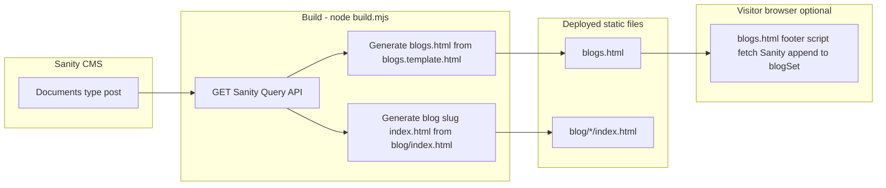

# Blog architecture

This document describes how **blog listing** and **blog post pages** are produced and served in the Axiostat Military static site. Use it when changing layout, queries, or the build.

**Related:** [SANITY.md](./SANITY.md) (Sanity project ID, API URLs, CMS details), [DEVELOPER-GUIDE.md](./DEVELOPER-GUIDE.md) (overall repo conventions).

---

## 1. Mental model

- **CMS:** [Sanity](https://www.sanity.io/). Editors work in Sanity Studio (not in this repo). This repo **reads** published documents via the **public Sanity HTTP Query API** (GROQ in the URL).

- **Build entrypoint:** `build.mjs` (run locally or on Netlify; see `netlify.toml`).

- **Output:** Plain static HTML checked into `/` — no runtime server rendering in this codebase.

---

## 2. URLs and redirects

| User-facing URL | Served as | Notes |
|-----------------|-----------|--------|
| `/blogs` | `blogs.html` | Listing page (blog index). |
| `/blog/<slug>/` | `blog/<slug>/index.html` | One static file per post after build. |

**Redirects:** `_redirects` includes `/blog → /blogs` (301). There is also a catch-all rule **`/blog/*` → `/blog/index.html`** (200). Prefer linking to **`/blog/<slug>/`** for individual posts once `build.mjs` has generated those folders; `/blog/index.html` is primarily a shell template plus legacy fallback.

---

## 3. Sanity content type: `post`

Posts are Sanity documents with `_type == "post"`. The build expects (at minimum):

| Field | Role |
|--------|------|
| `title` | Card + article heading. |
| `slug.current` | URL segment; required to emit `blog/<slug>/index.html`. Posts without `slug` are skipped for detail pages. |
| `publishedAt` | Date on cards and article. |
| `mainImage.asset._ref` | Card + optional banner (`image-*` ref → Sanity CDN URL). |
| `body` | Portable text; converted to HTML in `build.mjs` via `blocksToHtml()`. |

**Build query:**

```groq
*[_type=='post']|order(publishedAt desc)
```

**Project ID / dataset:** Hard-coded in `build.mjs` (`projectId`, `dataset`). Updating the Sanity project requires changing `build.mjs` and every browser-side Sanity reference — see `SANITY.md`.

---

## 4. End-to-end data flow



---

## 5. Listing page: `/blogs` (`blogs.html`)

### 5.1 Source files

| File | Purpose |
|------|---------|
| `blogs.template.html` | **Source** for the listing page. Same markup as shipped `blogs.html`, but **`build.mjs` overwrites `blogs.html`** — **edit `blogs.template.html`** for structural/UI changes that must survive the next build. |
| `blogs.html` | **Generated** by `build.mjs`. Do not hand-edit for content that rebuild removes; regenerate with `node build.mjs`. |

### 5.2 What `build.mjs` does for the listing

1. Fetches all `post` documents (same API as §3).

2. Renders HTML for each post as Bootstrap columns (`col-md-4` → `.blog_wrap`).

3. Injects that HTML **right after** the opening tag:

   ` <div class="row" id="blogSet"> `

   in `blogs.template.html`, then writes the result to **`blogs.html`**.

So **stored data** for SEO and first paint lives as **literal HTML nodes inside `#blogSet`** inside `blogs.html` after a successful build.

### 5.3 Client-side listing script (duplicate path)

The template also ships inline JavaScript that:

- **`fetch`**es `*[_type=='post']...` from Sanity in the **browser**.
- **`appendChild`**s cards into **`#blogSet`**.

Effects:

- If **`blogs.html` has empty `#blogSet`** (e.g. build not run locally), listing still fills **via this fetch**.
- If **build injected cards AND** this script runs, you can get **duplicate rows** unless the template or script is changed to avoid doubling.

**Practical guidance for engineers:**

- Decide on one canonical behavior: prefer **SSR-style static cards from build** (commit/deploy `blogs.html`), or **fetch-only**. If you rely on static injection, strip or gate the footer `fetch`/`createBlogList()` so duplicates do not appear.

---

## 6. Post detail pages: `/blog/<slug>/`

### 6.1 Template

| File | Purpose |
|------|---------|
| `blog/index.html` | **Template** for a single post. Paths use `../assets/` for local preview; `build.mjs` rewrites them to root-absolute `/assets/...` and strips client-side blog-fetch scripts from the generated file. |

### 6.2 What `build.mjs` does per post

For each post with `slug.current`:

1. Starts from the processed `blog/index.html` string.

2. Injects **`<title>`**, meta description, Open Graph, **canonical** `https://axiostatmilitary.com/blog/<slug>`.

3. Fills **`#blogHead`** (date, title, optional banner from `mainImage`).

4. Injects **`#blogContent`** with HTML from **`blocksToHtml(body)`** (portable text → paragraphs, links, emphasis, images).

5. Writes **`blog/<slug>/index.html`** (creates folders as needed).

Generated pages **do not** rely on runtime Sanity fetch for the article body (`build.mjs` removes those script blocks).

### 6.3 Portable text support in `blocksToHtml()`

Implemented in **`build.mjs`** only. Supported shapes include **`block`** (with limited marks/styles) and **`image`**. Extend `blocksToHtml()` when Sanity schema gains new block types or marks — otherwise content may be omitted or rendered as plain text.

---

## 7. Operational checklist

| Task | Action |
|------|--------|
| Regenerate listing + all post pages | `npm install` then `node build.mjs` (needs network + reachable Sanity API). |
| Change listing chrome (header/footer, grid wrapper) | Edit **`blogs.template.html`**, run build, commit **`blogs.html`**. |
| Change single-post layout wrapper | Edit **`blog/index.html`**, run build, commit generated **`blog/<slug>/index.html`** files. |
| Change how body HTML is produced | **`build.mjs`** → `blocksToHtml()`. |
| Point at a different Sanity project/dataset | Update **`build.mjs`** and all **`projectId` / `dataset`** in HTML (see **`SANITY.md`**). |

---

## 8. Deployment

`netlify.toml` runs **`node build.mjs`** on deploy. Published directory is `.`, so **`blogs.html`** and **`blog/**`** must be present in the deployed tree (committed or produced in CI before publish, depending on team workflow).

---

## 9. Troubleshooting

| Symptom | Likely cause |
|---------|----------------|
| `build.mjs` fails | Network, Sanity outage, invalid query. |
| Empty listing with no JS | **`#blogSet` empty** and scripts blocked or failing; run build or inspect console for Sanity/CORS errors. |
| Duplicate blog cards | Build-injected HTML **plus** footer script both appending to `#blogSet` — align on one mechanism. |
| 404 on `/blog/<slug>/` | Post missing `slug` in CMS, build not run, or file not deployed. |

---

## 10. File map (blog-specific)

```
blogs.template.html     # Listing source (preserved across builds unless overwritten mistakenly)
blogs.html              # Listing output — generated by build.mjs

blog/index.html         # Single-post template
blog/<slug>/index.html  # One generated file per published post slug

build.mjs               # Sanity fetch → blogs.html + blog/<slug>/index.html
```

---

*Last updated to match the blog pipeline in this repository. When you change `build.mjs` behavior, update this document in the same change.*
